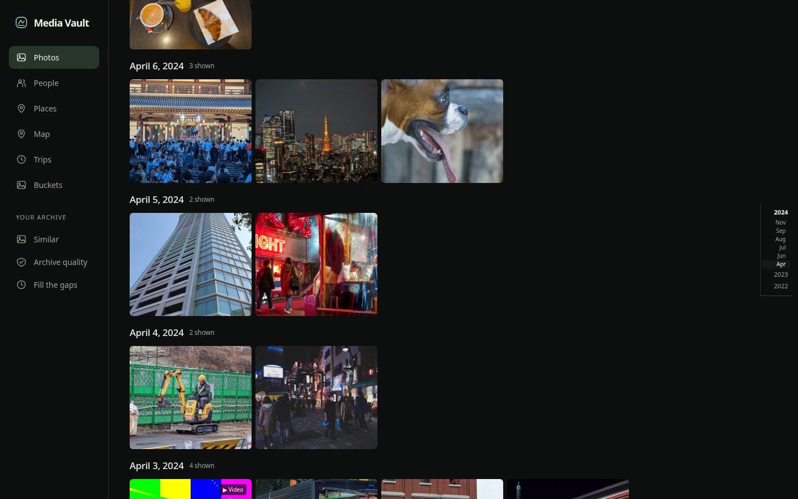
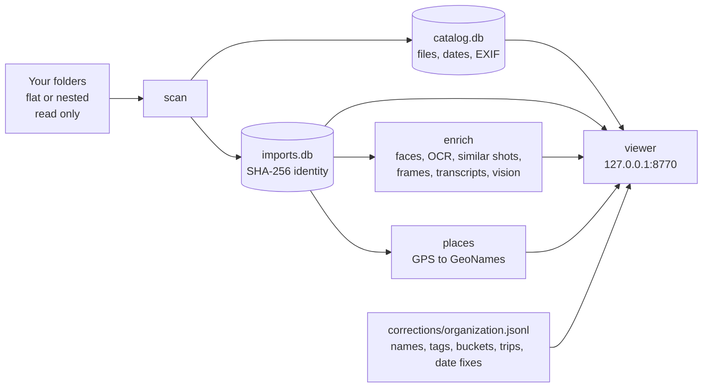
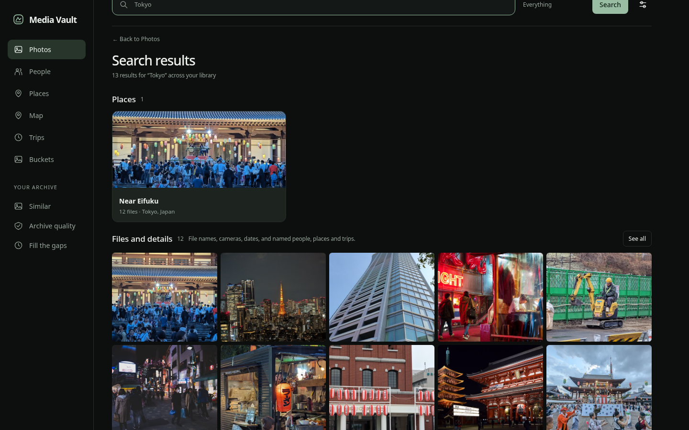
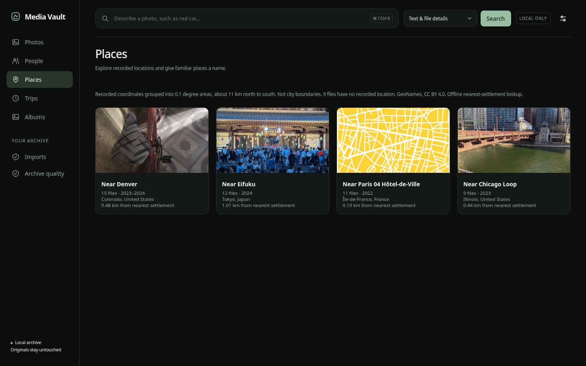
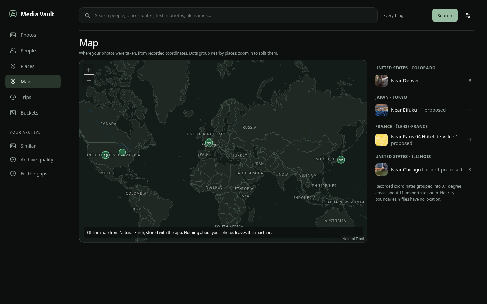
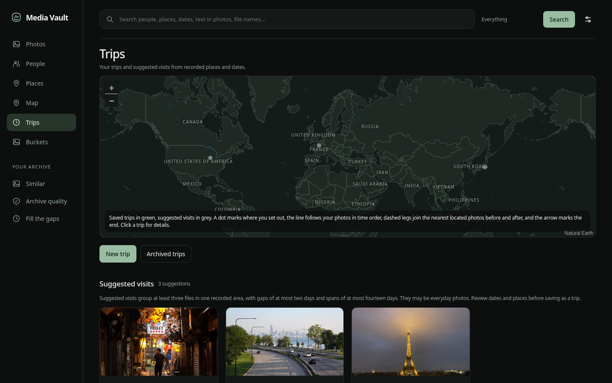
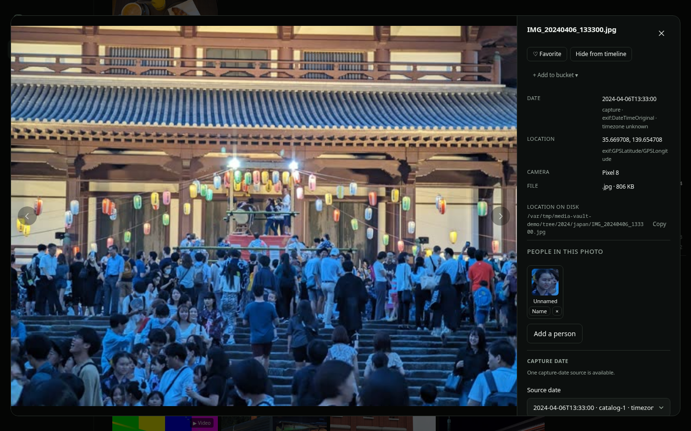
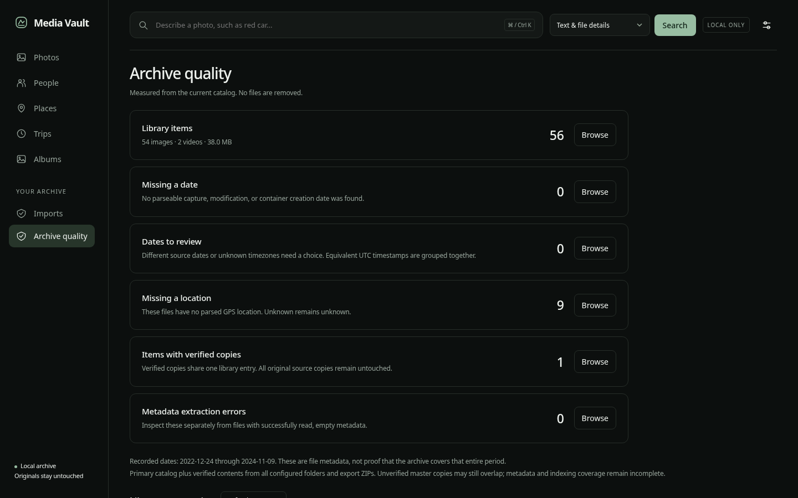

# Media Vault

A private photo and video library that runs on your own computer. Point it at the folders
your pictures already live in and it builds a catalog beside them: a timeline, people,
places, trips, buckets, similar shots and search, served as a page on localhost. Your originals
are never moved, renamed or written to. No image ever leaves the machine.



Optional local AI adds faces, text in photos, image search by description, video transcripts
and scene previews. Each is a model you download once and run offline. Skip any of them and
the rest of the vault works the same. The screenshots on this page come from a test library
of CC0 photos from Wikimedia Commons, stamped with made-up dates and GPS so the trips and
places have something to show. None of it is anyone's real library.

## Set it up

Clone the repo, then run one command from its folder with whatever Python you have:

```
python vault.py setup "D:\Pictures"
```

Name the folder your pictures and videos are in, nested folders and all. It installs the
command-line tools, builds the Python environment, writes the config, downloads the small
models, scans the library, runs the AI passes until nothing is left, labels places from GPS,
and prints the viewer URL. It skips whatever is already done, so running it again after a
failure or a reboot carries on from there.

The targets are Windows 11 and Arch-based Linux (CachyOS), and they are not equally proven.
The one-command path has been run start to finish on Linux. On Windows the setup has only
been done by hand so far, one step at a time, on a 1,560-file library; the winget installs
and the PATH repair in the setup command are built from that run but have not been executed
end to end there yet. `docs/windows-setup-notes.md` is the field report, including the two
crashes it turned up and the fixes.

`python vault.py setup --options "D:\Pictures"` first prints what this machine gets: the
features that need no model, the default download, and the extras, with image search by
description marked recommended when an NVIDIA GPU is present.

Or open the clone in Claude Code (or any coding agent that reads `CLAUDE.md` or
`AGENTS.md`) and say:

> Set up Media Vault for the photos in D:\Pictures.

The agent prints that offer, reads it back to you in a few lines, runs the setup command with
whatever you picked, watches it, answers the one or two questions it can raise (a password
for the Linux package install), and hands you the URL.

## Set it up by hand

`docs/setup.md` has every command. The short version:

1. `ffmpeg`, `ffprobe`, ImageMagick and Tesseract on your PATH.
2. Python 3.11 to 3.13 in `.venv`, then `pip install -r requirements.txt`.
3. `cp vault.config.example.json vault.config.json` and set `sources` to your folders.
4. `python vault.py doctor` until it prints `READY`.
5. `python vault.py scan`, then `python vault.py`, then open http://127.0.0.1:8770.

## How it works



**Scan** walks each source, records every image and video, hashes its contents and asks
ImageMagick and ffprobe for dates, dimensions, camera and GPS. Two copies of the same photo
in different folders become one library entry with both locations. A source on an unplugged
drive is reported, not forgotten; the next scan picks it up where it left off.

**Enrich** runs the optional stages in separate worker processes, one per model, only for
the models you have installed. Each worker re-hashes its model files against a receipt
before it loads them, and every fact it writes carries the identity of the model that
produced it, so two model versions can never be confused in one catalog.

**The viewer** reads the catalog and serves the page. It binds 127.0.0.1 only. Thumbnails
are resized copies in `.catalog/previews`; the originals are opened read-only and never
touched.

**Corrections** are yours. Naming a person, tagging a photo, fixing a date, saving a trip or
filling a bucket appends a line to `corrections/organization.jsonl`, keyed by content hash.
Delete the whole `.catalog/` folder, rescan, and every correction comes back. That one file
is the thing to back up alongside your photos.

## What you get

### One search box

Type a name, a place, a date, a camera, a word from a sign in a photo, or a file name. The
suggestions name what matched and where it came from; Enter searches everything and groups
the results by kind. Add the SigLIP2 weights and you can also type "dog on a beach" and get
matching photos, computed on your GPU or CPU, with your corrections ("that is not a dog")
kept as reviews.



### Places, map and trips

GPS coordinates are grouped into small areas and resolved against an offline GeoNames
snapshot, so "Near Paris 04 Hôtel-de-Ville" comes from a 14 MB table on disk, not a web
call. The map is Natural Earth, stored with the app. Runs of days away from home become
suggested visits you can review, name and save as trips.







### Every file, with its evidence

Each date shows where it came from (EXIF, container creation time, file modification) and
whether the timezone is known. The detail panel lists the camera, the raw coordinates, the
file size and the path on disk, offers favorite, hide and bucket actions, and shows the
faces found in the photo so you can name them in place.



### People

Faces are detected and grouped locally with OpenCV's YuNet and SFace models. The vault
suggests groups; you supply names, merge groups, hide people you do not want to see. A name
is a correction, never a model output, and it survives a rebuild or a change of face model.
Videos get the same treatment: the face pass reads the keyframes the frame sampler keeps, one
face per person per video, so naming a face brings that person's videos into their results,
and the detail panel says when in the video each face was seen.

### Buckets and similar shots

Buckets are your own collections, kept in the corrections file. Similar shots stacks
near-duplicates and bursts so the grid shows one of each, with a `⧉ 3` badge on the one it
shows. Click the badge and the stack fans out in place: click a shot to make it the top, or
Separate to keep them apart. The stack is a view, and nothing is deleted or hidden for good.

### Archive quality and filling the gaps

A running audit of what the catalog knows and does not: files with no date, dates that
disagree between sources, files with no location, verified copies, and metadata errors.
"Fill the gaps" proposes dates and places from the archive's own evidence, a group at a
time, and writes nothing until you accept.



## Optional models

| Model | Adds | Download | Runs on |
|---|---|---|---|
| YuNet + SFace | people | 39 MB | CPU |
| GeoNames cities500 | place names | 14 MB | CPU |
| faster-whisper small | video transcripts | 486 MB | CPU |
| SigLIP2 base | image search, similar images, video moments | 1.5 GB plus torch | GPU or CPU |

```
python vault.py setup-models --faces --gazetteer
python vault.py enrich --once
python vault.py places
```

`docs/models.md` lists each model's source, pinned revision, license and checksum, and what
to install on a machine without a GPU. Downloads are the only time this software talks to
the network; afterwards the workers run with Hugging Face offline mode forced on.

## Commands

```
python vault.py                 start the viewer
python vault.py scan            inventory, verify, attach metadata (repeat until "complete")
python vault.py scan --watch    keep watching for new files
python vault.py enrich          run whichever AI stages have their models installed
python vault.py places          resolve GPS to place names (needs the gazetteer)
python vault.py doctor          what is installed, what is configured, what fits this machine
python vault.py setup-models    download optional models
python vault.py test            unit tests
```

## Layout

```
vault.py                   launcher; re-executes itself inside .venv
vault.config.json          your sources, folders and port (copy the .example)
src/catalog.py             inventory and ImageMagick / ffprobe metadata
src/imports.py             content identity across sources
src/enrichment.py          supervisor for the optional AI stages
src/server.py              the localhost viewer and its API
src/portable.py            file locks and the removable-media guard, per OS
src/localindexkit/         vendored provenance and rebuild rules for derived facts
web/                       the page
scripts/doctor.py          the checklist an agent or a person runs
scripts/setup_models.py    pinned model downloads with checksum receipts
docs/                      setup, models, roadmap, changelog
```

## What it does not do

There is no cloud sync, no sharing link, no account, and no editing of your originals. The
viewer is for one person on one machine. Two gaps are known and open: Windows has no
equivalent of the systemd units `src/services.py` writes, so a Windows machine keeps new
files coming in by leaving `python vault.py scan --watch` in a terminal, and there is no
importer for a Google Takeout archive yet. `docs/roadmap.md` has the rest.

## Privacy

- The server listens on 127.0.0.1. There is no login because there is no network exposure.
- No telemetry, no update check, no crash reporting.
- Model downloads are the only outbound traffic, and only when you run `setup-models`.
- Source folders are opened read-only. Derived state is refused on removable media so an
  unplugged drive never takes the catalog with it.
- Everything under `.catalog/` and `models/` can be deleted and rebuilt. Only
  `corrections/organization.jsonl` holds anything you typed.

## License

MIT. The optional models carry their own licenses; `docs/models.md` lists each one.
